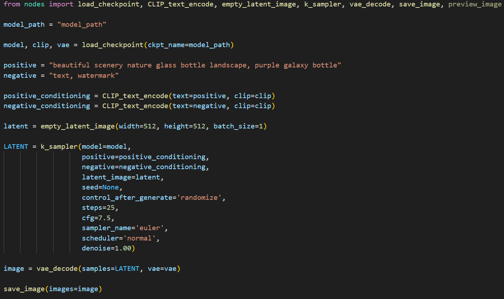

## ComfyUI-default-workflow-implementation



[ComfyUI](https://github.com/comfyanonymous/ComfyUI) 의 default workflow를 구현한 예제입니다. 구현 과정은 [Diffusers](https://github.com/huggingface/diffusers) 라이브러리를 참고하여 설계되었으며, 입력 및 출력 형식은 ComfyUI의 표준을 준수합니다.

## Supported Nodes

- Load Checkpoint
- CLIP Text Encoder (Prompt)
- Empty Latent Image
- Ksampler
- VAE Decode
- Save Image
- Preview Image

## Installation

아래 명령어를 사용하여 프로젝트를 설치하고 실행할 수 있습니다.  
PyTorch는 CUDA를 지원하는 버전을 설치해야 GPU 가속을 활용할 수 있으며, CUDA가 없는 환경에서는 CPU 버전을 사용할 수도 있습니다.

```bash
# CUDA 11.8을 사용하는 경우
pip install torch torchvision --index-url https://download.pytorch.org/whl/cu118

# CUDA 12.4을 사용하는 경우
pip install torch torchvision --index-url https://download.pytorch.org/whl/cu124
```

```bash
pip install -r requirements.txt
```

## Running Locally

```bash
python default_workflow.py
```

`Save Image` 노드를 사용할 경우, 생성된 이미지는 `output - ComfyUI_{숫자}`로 저장됩니다.
